# David Díaz Rodríguez

> Developing Data Science, AI, and Machine Learning tools with R and Python.

I am a data scientist and developer focused on artificial intelligence, machine learning, and data visualization. My work spans deep learning frameworks, time series forecasting, and environmental data analytics. These projects are built primarily with R, Python, and Shiny.

  
  
  
  
  
  
  
  
  
  
  

  &nbsp;&nbsp; 
  

### 🌍 Environmental & Global Impact
Data-driven applications and interactive visualizations designed to promote environmental awareness and explore global climate data.

### 🛠️ Developer Tools & Productivity
Extensions and tools tailored to streamline the development workflow, specifically targeting the R and Python data science ecosystems.

### 🧠 Data Science & AI Tools
Specialized packages and interactive applications for machine learning, deep neural networks, and robust time series forecasting models.

### 📚 Spanish R Translations
Collaborative localization projects dedicated to bringing essential R and Data Science knowledge to the global Spanish-speaking community.

   
   
   
   
   
   
   
  

> **Stats are auto-generated daily** by a GitHub Actions workflow that fetches live data directly from the GitHub API. No third-party services involved.
